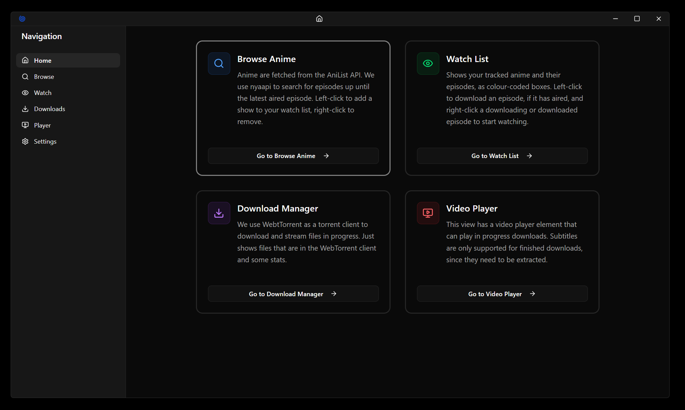
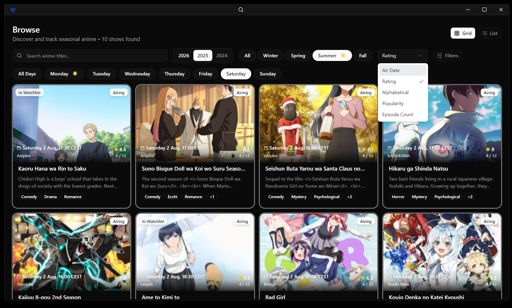
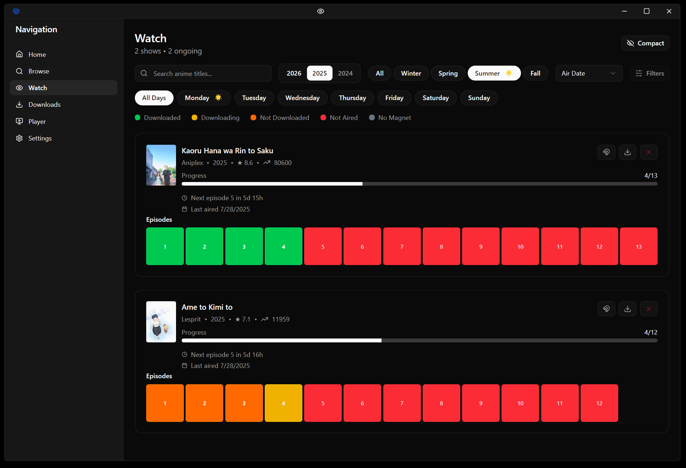
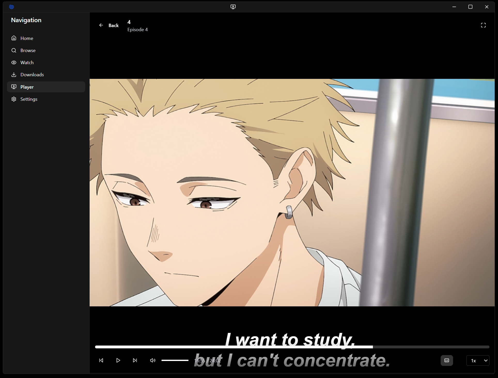

## Quick Setup

```sh
git clone https://github.com/ornifex/taida.git

cd taida

npm install

npm run dev
```

## Taida 

An Electron-based app made for tracking which anime you're watching, with a focus on the current season to stay up to date with what matters. Made during boot.dev hackathon.

Using a template from https://github.com/electron-vite/electron-vite-react

## Tech Stack
- Frontend: React, TypeScript, Tailwind CSS, shadcn
- Backend: Electron, Node.js
- Data: AniList GraphQL API, nyaapi for sourcing data
- Storage: Zustand with localStorage persistence
- Media: WebTorrent for downloading/streaming, ffmpeg subtitle extraction

## How to Use
There are 6 views, on each you can collapse the sidebar with CTRL+B.

### Landing

Just shows you in short what the app can do.

### Browse

Look through a selection of shows here, left-click to add to your list, right click to remove.

### Watch

Shows you the shows you're tracking, and which episodes have aired so far. There are buttons for fetching episodes, downloading all, and removing the show from your list. Left-click on an episode box to download, right-click to watch (after starting download).

### Downloads
Shows files and some stats.

### Player

Video player that supports subtitles. Left-click to pause/resume, right-click to fullscreen.

### Settings
Mostly to look pretty. Some dummy widgets and such for use later perhaps.

## Video Demo
Check out this short gif:

[]

## Day 1

- Browse: Scrape RSS feed, query AniList GraphQL for metadata, fuzzy match to combine (buggy), list shows as cards, click to add/remove to watchlist
- Watch: Colour coded boxes to see whether your downloads are finished, whether shows are available, click to start download, click to start playback (buggy)
- Downloads: WebTorrent used as a torrent client inside electron, add torrents from the Watch view, remove/pause/start torrents from here.
- Player: When a torrent is downloading or finish, you can click on it in the Watch view to start the videoplayer (buggy) (no subtitles)
- Settings: nonfunctional

For a first day's work, you can open the app, see shows, add/remove them to/from a watchlist, and download them to your computer with a click, and start watching them at the same time.

## Day 2

Small changes on all things. Biggest accomplishment today was implementing custom controls on top of the player, and subtitle support for files that have finished downloaded. Streaming subtitles to downloading files doesn't seem possible sadly. Playback is better, the app remembers what you were watching and where you left off. Most data now persists as well with zustand and localStorage. Torrents are saved, and resumed when you restart. Added some filtering and search elements, and some logic for converting timestamps into dates or timespans so you know when your shows are airing and how long from now.

I dont't like how I'm handling fetching episodes though, so I hope I can improve on that tomorrow by using an API instead of just an RSS feed with only 50 entries.

## Day 3

Many small UI changes and bugfixes and redundancy fixes. Mainly now torrents are fetched through nyaapi, on demand if needed, and use different matching logic. Still not perfect but at least more content shows up in the app and it looks more lively. Added a download all button along with the on demand fetch button. Periodically checks are made to grab new episodes, every few hours to not overload the API. Also added a landing page with quick introductions. Added custom title bar replacing the native OS one. Normalised the filter settings and elements across views, too. Lots of code clean up for sanity. Some elements are non-functional still, like swapping the grid view to a list view, but that's because I wasn't happy with them and didn't want to spend time on looks instead of functionality.

## Day 4

Submission day. Finished writing the readme and finalised code.

## Known Issues
- Subtitle streaming only works for completed downloads
- Some UI elements (like list view toggle) are non-functional
- Episode matching, series fetching logic still needs improvement
- Settings page basically for show

## Future Work
- Better visual feedback for the user when something happens (notifications, modals)
- Work on AniList API logic to more gracefully populate the library
- Work on name matching
- Make settings do something
- Implement or remove different views
- Maybe detect if there are multiple sub tracks, etc.
- Use AI to do something


## Disclaimer
This application is for educational purposes only. Users are responsible for ensuring they comply with local copyright laws when downloading content.
